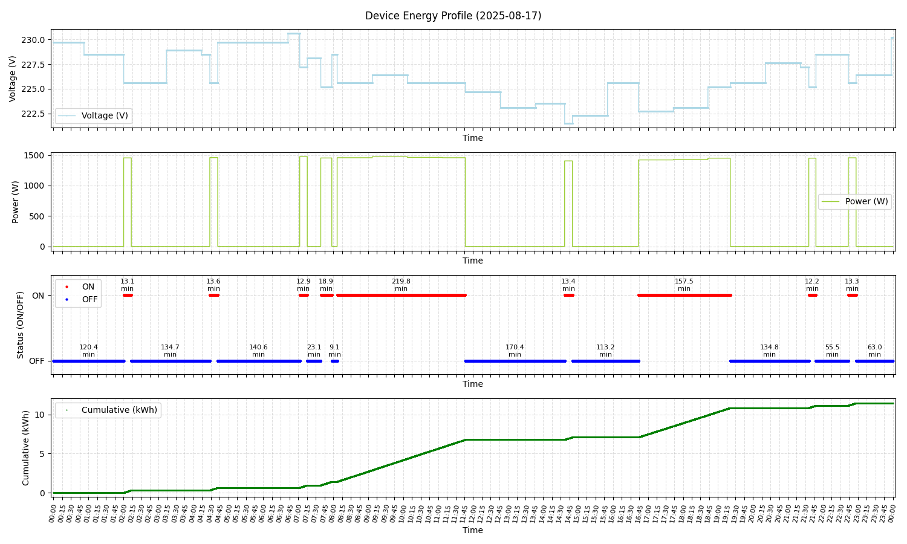

# SmartPlug Monitor

A Python tool to read, log, and visualize metrics, usage, and power consumption from a ["Tuya"](https://www.tuya.com/) smart plug.

Supports real-time data collection (voltage, current and power) and visualization of usage patterns through time.
Saves daily logs as CSV files.

## Installation

1. Clone the repository and install the requirements file.

> Using a virtual environment is strongly suggested

```bash
pip install -r requirements.txt
```

2. Follow the [Tinytuya device preparation guide](https://github.com/jasonacox/tinytuya#tuya-device-preparation) to connect with your device.
3. Replace `YOUR_DEVICE_ID` and `YOUR_LOCAL_KEY` in `main()` inside the `monitor.py` file, with your smart plug credentials.

## Usage

### To start capturing data from your device:

```bash
python monitor.py
```
You can find the generated logs inside the `logs/` directory.

### To visualize the metrics of a specific file

```bash
python visualize_usage.py <filename>
```
> `filename` is the name of the file **inside** the `logs` directory (there's no need to add `logs/` to this argument).


## CSV Structure

Each CSV file contains the following columns:

- `timestamp` – date and time of the measurement
- `voltage` – voltage in volts (V)
- `current` – current in milliamps (mA)
- `power` – power in watts (W)

## Sample output



## WIP
- Refactorize the visualization script.
- FIX: The logs skip seconds from time to time because it uses `sleep(1)` between calls to not overload the smart plug + the amount of time that the plug takes to answer the request, right now these missing rows can be filled up by using Pandas resample by second `df = df.resample("1s").ffill()`, basically if a measurement of 1 second is missing it makes a copy of the last entry before that one, in this case it's totally fine because most of the time the values stay constant between seconds.
